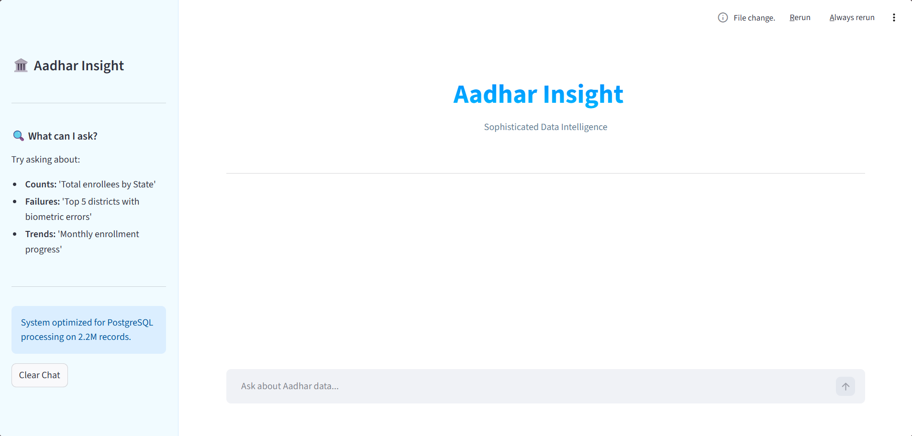

# 🏛️ Aadhar Insight: Sophisticated Data Intelligence

An AI-powered analytics agent designed to query, visualize, and analyze **2.2 Million rows** of UIDAI Aadhar enrollment data using Natural Language.

## 🚀 Project Overview
The **Aadhar Insight** platform bridges the gap between massive, complex SQL databases and end-users. Instead of writing manual SQL queries, users can interact with the data using natural language. The system interprets the intent, executes optimized SQL against a PostgreSQL backend, and returns structured analysis alongside interactive visualizations.

## ✨ Key Features
- **Generative AI Querying:** Integrated **Gemini 1.5 Flash** with **LlamaIndex** to translate English questions into high-performance SQL.
- **Big Data Optimization:** Engineered to handle and process a dataset of **2.2 Million records** stored in PostgreSQL.
- **Dynamic Dashboard:** A custom **Streamlit** interface with a "Soft UI" aesthetic.
- **Interactive Visuals:** Automated bar charts generated via **Plotly Express** based on real-time data results.
- **Modular Data Views:** Uses expandable sections to organize Analysis, Visualizations, Raw Data, and the generated SQL Query for transparency.
- **Enterprise Security:** Implemented `python-dotenv` for secure management of API keys and database credentials.

## 🛠️ Tech Stack
- **AI Model:** Google Gemini 1.5 Flash
- **Orchestration:** LlamaIndex (NLSQLTableQueryEngine)
- **Database:** PostgreSQL & SQLAlchemy
- **Frontend:** Streamlit
- **Visualization:** Plotly & Pandas

## 📂 Project Structure
- `app.py`: Main application UI and session state management.
- `body.py`: AI engine configuration and LlamaIndex logic.
- `database_connection.py`: Secure database engine setup.
- `.env.example`: Template for required environment variables.
- `.gitignore`: Ensures sensitive files like `.env` and `__pycache__` are not tracked.

## 📦 Installation & Setup
To run this project locally, follow these steps:

1. **Clone the Repo:**
   ```bash
   git clone [https://github.com/susendran-k/Natural-Language-to-SQL.git](https://github.com/susendran-k/Natural-Language-to-SQL.git)
   cd Natural-Language-to-SQL```

2. **Install Dependencies:**
   ```bash
   pip install streamlit llama-index-llms-gemini sqlalchemy psycopg2 python-dotenv plotly pandas ```
   
3. **Configure Environment:**
   Create a .env file in the root directory and add:

      GEMINI_API_KEY=your_key
      DB_USER=postgres
      DB_PASSWORD=your_password
      DB_HOST=localhost
      DB_NAME=your_db_name
   
4. **Run the App:**
    ```bash
    streamlit run app.py

Developed as a sophisticated data intelligence solution for high-volume Aadhar record analysis. 
